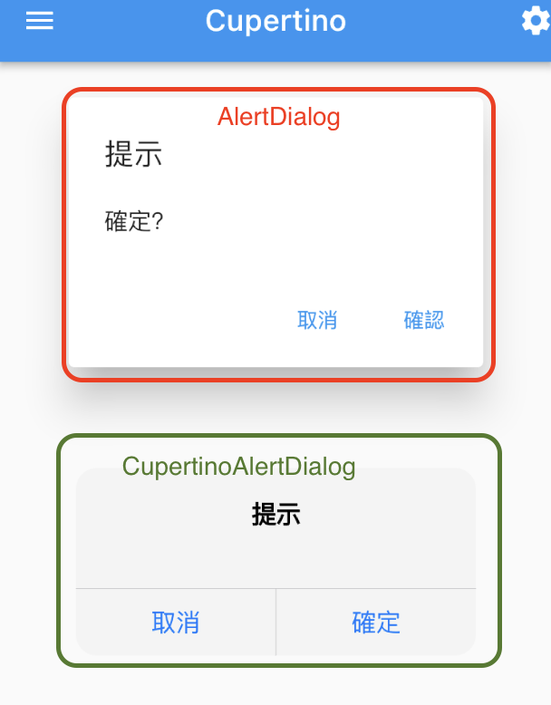

# flutter_tutorial

## 01_basic

### 01_hello

### 02_text

## 02_layout

### 01_Container

### 02_Column_Row

### 03_Flex

### 04_Wrap

### 05_Stack

### 06_Card

## 03_Button

## 04_Image

## 05_List
### 01_SingleChildScrollView

### 02_ListView

### 03_GridView

### 04_GridView

### 05_others

