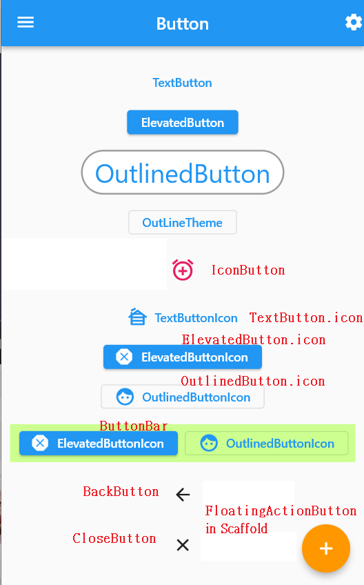

# flutter_tutorial

## 01_basic

### 01_hello

### 02_text

## 02_layout

### 01_Container

### 02_Column_Row

### 03_Flex

### 04_Wrap

### 05_Stack

### 06_Card

## 03_Button

## 04_Image

## 05_List

### 01_SingleChildScrollView

### 02_ListView

### 03_GridView

### 04_GridView

## 06_others

## 07_thirdparty

### 02_swiper

## 08_state

### 01_StatefulWidget

### 02_DataTable

## 09_navigation

### 05_drawer

_drawer菜單是scaffold的一個內容_
  
_click`關於`_  

### 06_BottomNavigatorBar

### 07_Tab

## 10 form

### 01_switch

### 02_CheckBox

### 03_Radio

### 04_TextField

### 05_Calender

### 06_Form

#### TextFormField

必須建`GlobalKey`  
比`TextField`多了`validator`屬性

### 07_Form

## 11 Other

### 01_Animation

### 02_StaggerAnimation

